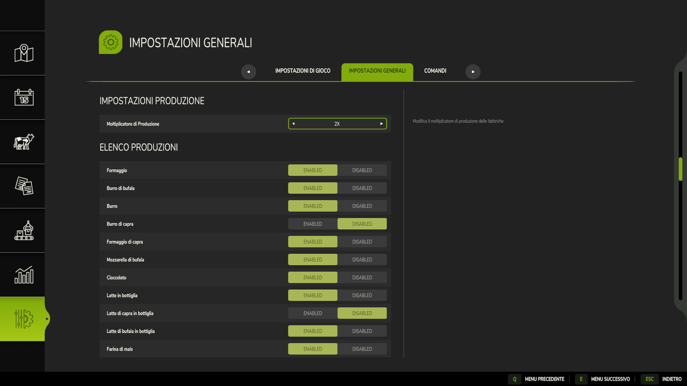

This is a WIP
Mods for Farming Simulator 25

Production Multiplier

It basically allows you to multiply the production speed of the factories in the game

in the settings menu you can choose the speed at which to set the production:
X2,X3,X4,X5

and on which products to enable the multiplier

Maintenance system (WIP) of factories, pressing the default key M opens a window where you can see the maintenance status and pay for the repair
The maintenance status will influence the production speed 

Be careful, in August and December people go on holiday and production is reduced to X1 but factories take the opportunity to carry out maintenance and restart with maximum efficiency

Please take in mind that I'm no programmer and this is my first time trying to do something like this
there is probably BS on my code so any contributions are welcome

